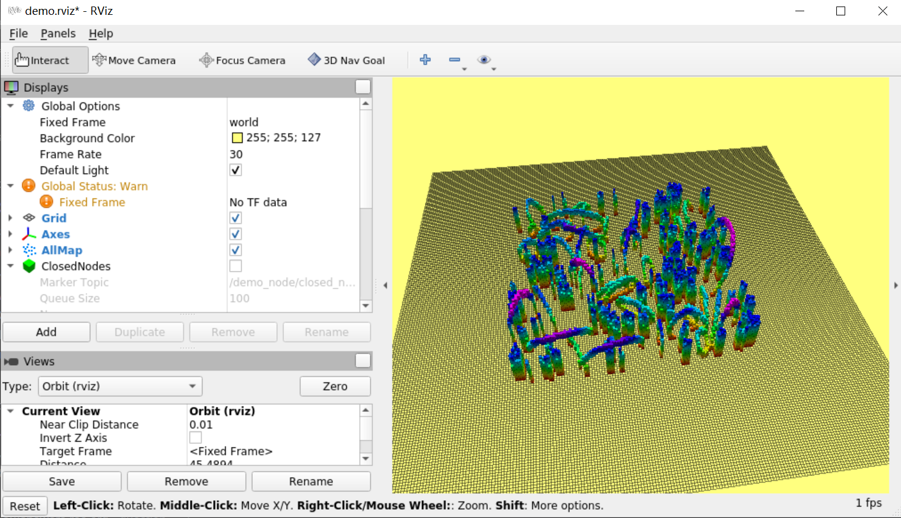
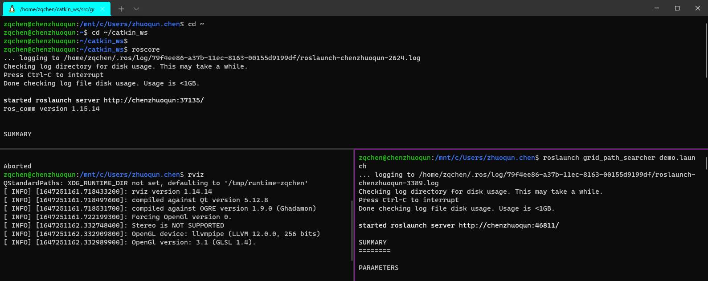

# zqchen-第1章作业

## 我的环境配置

助教老师的讲解视频中配套的`hw_1.zip`，解压后的功能包是在`Ubuntu16.04`环境下测试的，而我的环境和这个不一样，需要踩坑。

我的测试环境`1`为：

+ `DELL-Ubuntu20.04`
+ `ROS-Noetic（pcl-1.10）`

我的测试环境`2`为：

+ `Thinkpad-Win10-WSL2-Ubuntu20.04`

+ `ROS-Noetic（pcl-1.10）`

  

按照助教老师的操作顺序，在测试环境`2`下会出现以下两个问题：

## 问题1: PCL1.10需要C++14才能编译

此时需要在`grid_path_searcher`功能包的`CMakeLists.txt`中做修改：

```cmake
# set(CMAKE_CXX_FLAGS "-std=c++11 ${CMAKE_CXX_FLAGS} -O3 -Wall") # -Wextra -Werror
set(CMAKE_CXX_STANDARD 14)
```

把编译选项调整为`C++14`。

## 问题2: roslaunch运行节点后Rviz中仍不显示地图

这是因为有一个发布的话题的错误，把`frame`处的字符串把`/world`改为`world`后，重新`catkin_make`再显示就正常了。如图：






测试环境`2`毕竟是虚拟机环境，渲染的很慢很卡，此时需要在测试环境`1`中也做测试。测试环境`1`中同样需要解决问题`1`和问题`2`。此外，测试环境`1`还需要解决之前的`Eigen3`路径问题，因此这里就不详细说了。